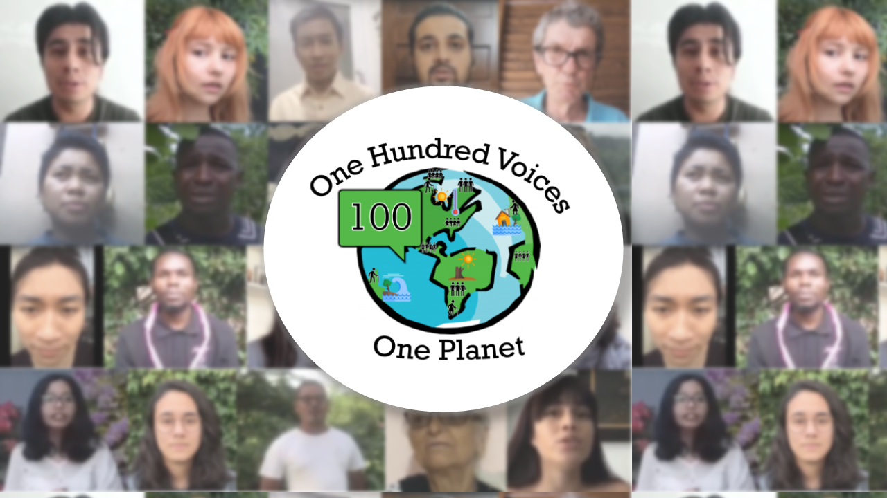
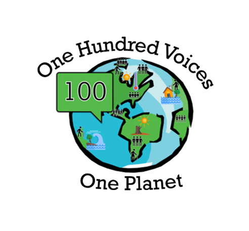

## Welcome to 100 Voices Project!

This repository contains those graphic elements that have been implemented on the project website [100 Voices](https://100vop.org/). All visualisations have been developed in the R language.

## Authors:
Ophelia Watch \
[Vanessa Zwisele](https://github.com/V-Zwisele) \
[Isaac Bravo](https://github.com/IsaacBravo)

## Static Website

The website can be viewed [here!](https://100vop.org/)

 

 
 

  

  
  

  
  
  
     

  

  

